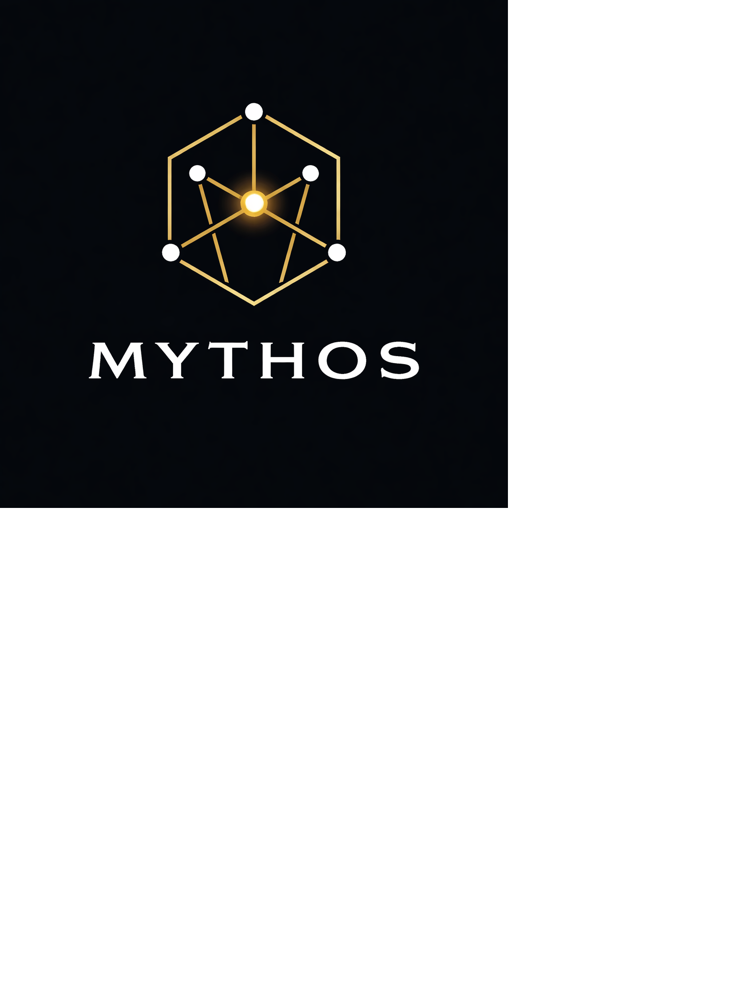

# Mythos Engine
   

---

**Mythos** is a procedural game engine and built-in editor focused on **graph grammar–driven world generation**.  
Instead of hand-authoring levels, Mythos generates environments, structures, and layouts from a small set of primitive rules, allowing worlds to grow, evolve, and age over time.

Mythos is designed for developers who want:
- Emergent environments instead of static level design
- Data-driven procedural generation
- Tight iteration loops through an integrated editor
- Systems that scale from 2D layouts to fully connected 3D spaces

---
 
## Core Philosophy

Traditional engines ask *“What does this level look like?”*  
Mythos asks *“What rules created this world?”*

At its core, Mythos treats environments as **graphs**:
- Nodes represent primitives (rooms, roads, tiles, structures, terrain chunks)
- Edges define spatial, logical, or semantic relationships
- Grammar rules describe how graphs expand, connect, or transform

This approach enables:
- Infinite variation from small rule sets
- Easy regeneration without hand-placed content
- World evolution driven by time, history, or simulation state

---

## Key Features

### Graph Grammar Generation
- Procedural environments built from grammar rules
- Deterministic or stochastic generation
- Rule extraction from example layouts (planned)

### Integrated Editor
- Visual graph inspection and debugging
- Primitive placement and rule authoring
- Importing external assets (e.g. OBJ meshes) as graph primitives

### Time-Driven Worlds
- Worlds can evolve instead of resetting
- Structures, roads, rivers, and landmarks can age over time
- Enables mechanics like time travel, historical layers, and persistent landmarks

### Engine-First Design
- Clean C++ core focused on generation and data flow
- Rendering treated as a consumer of generated data
- Designed to support multiple gameplay styles (simulation, RTS, exploration, puzzle)

---

## Current State

Mythos is under **active development** and should be considered **experimental**.  
APIs, data formats, and editor workflows are expected to evolve rapidly.

---

## Roadmap

### Phase 1 — Foundations (Current)
- [x] Core graph data structures
- [x] Primitive-based procedural generation
- [x] Grammar rule execution system
- [x] Basic editor for visualization and inspection
- [x] OBJ asset importing
- [ ] Deterministic generation via seeds
- [ ] Save/load of graphs and rule sets

### Phase 2 — Authoring & Rules
- [ ] Visual rule editor
- [ ] Grammar rule extraction from example graphs (JSON-based)
- [ ] Rule validation and conflict detection
- [ ] Layered graphs (layout vs detail vs decoration)

### Phase 3 — Spatial Expansion
- [ ] Clear separation of 2D and 3D graph implementations
- [ ] Vertical stacking and multi-level structures
- [ ] Navigation graph generation
- [ ] Spatial queries and graph traversal utilities

### Phase 4 — Time & Evolution
- [ ] Time as a first-class system
- [ ] Aging rules for structures and terrain
- [ ] Persistent landmarks across regenerations
- [ ] World state replay and rollback

### Phase 5 — Runtime & Gameplay Integration
- [ ] Runtime graph streaming
- [ ] Gameplay hooks driven by graph events
- [ ] AI and simulation systems consuming graph data
- [ ] Scripting layer for rules and events

---

## Non-Goals (For Now)

- Photorealistic rendering
- AAA asset pipelines
- Hand-authored cinematic level design

Mythos is about **systems, structure, and emergence first**.

---

## Who Is Mythos For?

- Engine programmers
- Procedural generation researchers
- Indie developers exploring non-linear world design
- Anyone tired of hand-placing the same rocks over and over

---

## License

License information will be added once the public release strategy is finalized.

---

## Status

🚧 **Heavy Development**  
Expect breaking changes. Expect experiments. Expect weird ideas.

That’s the point.